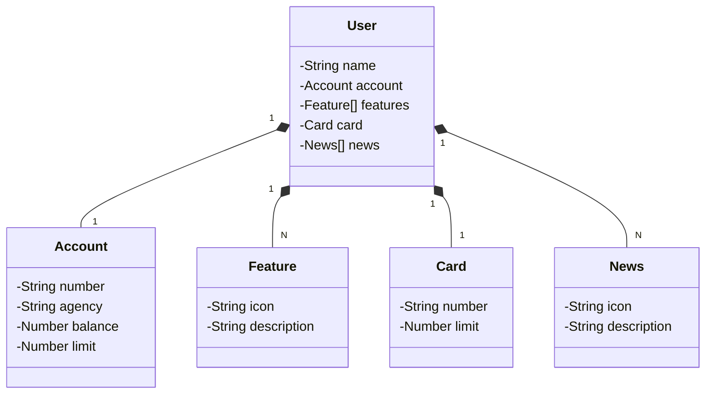

# Deal - Spring Boot e Angular (17+)

## Principais Tecnologias
 - **Java 17**: Utilizaremos a versão LTS mais recente do Java para tirar vantagem das últimas inovações que essa linguagem robusta e amplamente utilizada oferece;
 - **Spring Boot 3**: Trabalharemos com a mais nova versão do Spring Boot, que maximiza a produtividade do desenvolvedor por meio de sua poderosa premissa de autoconfiguração;
 - **Spring Data JPA**: Exploraremos como essa ferramenta pode simplificar nossa camada de acesso aos dados, facilitando a integração com bancos de dados SQL;
 - **OpenAPI (Swagger)**: Vamos criar uma documentação de API eficaz e fácil de entender usando a OpenAPI (Swagger), perfeitamente alinhada com a alta produtividade que o Spring Boot oferece;
 - **Railway**: facilita o deploy e monitoramento de nossas soluções na nuvem, além de oferecer diversos bancos de dados como serviço e pipelines de CI/CD.

## [Link do Figma](https://www.figma.com/file/0ZsjwjsYlYd3timxqMWlbj/SANTANDER---Projeto-Web%2FMobile?type=design&node-id=1421%3A432&mode=design&t=6dPQuerScEQH0zAn-1)

O Figma foi utilizado para a abstração do domínio desta API, sendo útil na análise e projeto da solução.

## Diagrama de Classes (Domínio da API)

## Documentação da API (Swagger)

## Endpoints

### Users

| Método HTTP | Prefixo | Endpoint          | Descrição                               |
| ----------- | ------- | ----------------- | --------------------------------------- |
| GET         | /api/v1 | /user             | Retorna uma lista paginada de usuários  |
| GET         | /api/v1 | /user/1           | Retorna o usuário com o id 1            |
| POST        | /api/v1 | /user             | Cria um usuário                         |
| PUT         | /api/v1 | /user/1           | Atualiza o usuário com o id 1           |
| DELETE      | /api/v1 | /user/1           | Remove o usuário com o id 1             |

### [https://api-rest-spring-railway.up.railway.app/swagger-ui.html](https://api-rest-spring-railway.up.railway.app/swagger-ui.html)

# Getting Started

### Reference Documentation
For further reference, please consider the following sections:

* [Official Gradle documentation](https://docs.gradle.org)
* [Spring Boot Gradle Plugin Reference Guide](https://docs.spring.io/spring-boot/3.3.2/gradle-plugin)
* [Create an OCI image](https://docs.spring.io/spring-boot/3.3.2/gradle-plugin/packaging-oci-image.html)
* [Spring Web](https://docs.spring.io/spring-boot/docs/3.3.2/reference/htmlsingle/index.html#web)
* [Spring Data JPA](https://docs.spring.io/spring-boot/docs/3.3.2/reference/htmlsingle/index.html#data.sql.jpa-and-spring-data)

### Guides
The following guides illustrate how to use some features concretely:

* [Building a RESTful Web Service](https://spring.io/guides/gs/rest-service/)
* [Serving Web Content with Spring MVC](https://spring.io/guides/gs/serving-web-content/)
* [Building REST services with Spring](https://spring.io/guides/tutorials/rest/)
* [Accessing Data with JPA](https://spring.io/guides/gs/accessing-data-jpa/)

### Additional Links
These additional references should also help you:

* [Gradle Build Scans – insights for your project's build](https://scans.gradle.com#gradle)
